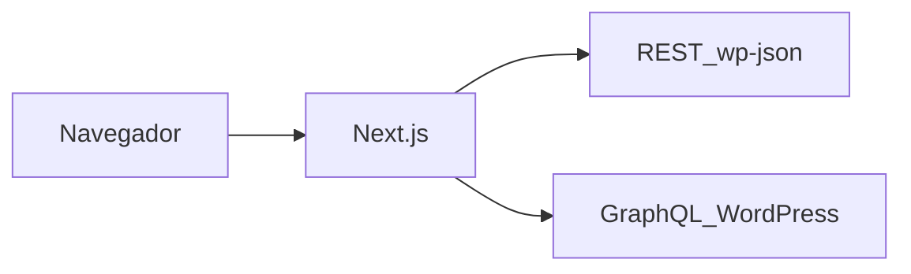

# Grupo Real Institucional

Front-end do site institucional do [Grupo Real](https://gruporealbr.com.br/), construído com Next.js e integrado a um WordPress headless (REST API e GraphQL).

## Stack

| Tecnologia | Uso |
|------------|-----|
| [Next.js 15](https://nextjs.org/) | App Router (`src/app/`), rotas e API routes |
| [React 19](https://react.dev/) | Interface |
| [TypeScript](https://www.typescriptlang.org/) | Tipagem |
| [Tailwind CSS](https://tailwindcss.com/) | Estilos |
| [Apollo Client](https://www.apollographql.com/docs/react/) + [GraphQL](https://graphql.org/) | Conteúdo WordPress via GraphQL |
| REST (`/wp-json/wp/v2/`) | Posts, produtos, representantes, mídia, comentários e outros CPTs |
| [Radix UI](https://www.radix-ui.com/) / [shadcn](https://ui.shadcn.com/)-like | Componentes em `src/components/ui` |
| [Leaflet](https://leafletjs.com/) + [react-leaflet](https://react-leaflet.js.org/) | Mapa na página de representantes |
| [next-sitemap](https://github.com/iamvishnusankar/next-sitemap) | Sitemap estático na build |

O script de desenvolvimento usa [Turbopack](https://nextjs.org/docs/app/api-reference/cli/next#development) (`next dev --turbopack`).

## Pré-requisitos

- [Node.js](https://nodejs.org/) 18 ou superior (recomendado: LTS atual)
- Um gerenciador de pacotes: `npm`, `yarn` ou `pnpm`

## Configuração de ambiente

1. Copie o arquivo de exemplo e ajuste as URLs para o seu WordPress e APIs:

   ```bash
   cp .env.example .env.local
   ```

2. Preencha as variáveis conforme [`.env.example`](.env.example) (mesma ordem e chaves do `.env` de produção). Variáveis `NEXT_PUBLIC_*` são expostas ao browser; sem as usadas pelo código, o `next build` ou o runtime podem falhar.

| Variável | Descrição |
|----------|-----------|
| `WP_URL` | URL base do CMS (conteúdo WordPress). Mantida alinhada ao ambiente; pode ser usada por scripts ou integrações. |
| `NEXT_PUBLIC_URL_HOST` | URL pública do site front-end (domínio que o usuário acessa). |
| `WP_URL_API` | Base da REST API (`.../wp-json/wp/v2/`). Espelho operacional da API; o app usa `NEXT_PUBLIC_WP_URL_API` nos fetches. |
| `NEXT_PUBLIC_WP_URL_GRAPH` | Endpoint GraphQL principal (Grupo Real). Usado por Apollo em [`src/lib/apollo-client.ts`](src/lib/apollo-client.ts). |
| `NEXT_PUBLIC_WP_URL_GRAPH_HOMEOPET` | Endpoint GraphQL da marca Homeopet. |
| `NEXT_PUBLIC_WP_URL_HOMEOPET_API` | Base REST para posts Homeopet (ex.: últimas notícias na home). |
| `NEXT_PUBLIC_WP_URL` | URL base do WordPress exposta ao cliente (conteúdo). |
| `NEXT_PUBLIC_WP_URL_API` | Base da REST API usada no código: posts, produtos, representantes, categorias, comentários, mídia, páginas, busca etc. |
| `NEXT_PUBLIC_WP_URL_API_V1` | Base dos endpoints customizados (`.../wp-json/api/v1/`): leads, newsletter, representante, WhatsApp, atendimento ao titular. |
| `NEXT_PUBLIC_WP_URL_API_CUSTOM` | Base REST do plugin Next Config (`.../wp-json/custom/`): menu da sidebar institucional (`institutional-sidebar`). |
| `NEXT_PUBLIC_WP_AUTH_TOKEN` | (Opcional no exemplo comentado.) Token Bearer para `getPostsNoticiasPage`. |

## Instalação e execução

```bash
# Instalar dependências (use um só)
npm install
# ou: yarn
# ou: pnpm install
```

```bash
# Desenvolvimento — http://localhost:3000
npm run dev
```

```bash
# Build e servidor de produção local
npm run build
npm run start
```

Garanta que `.env.local` está correto antes do `build`: várias rotas fazem `fetch` durante a geração estática ou no servidor.

## Scripts

| Script | Comando |
|--------|---------|
| `dev` | Servidor de desenvolvimento com Turbopack |
| `build` | Build de produção |
| `start` | Sobe o servidor após `build` |
| `lint` | ESLint (`next lint`) |
| `format` | Prettier em todo o projeto |

## Estrutura do repositório

- **`src/app/`** — Rotas do App Router: home, `noticias`, `artigos`, `busca`, `categoria`, `author`, `produtos`, `linhas`, `representantes`, `seja-representante`, `contato`, `downloads`, `quem-somos`, `historia`, campanhas (`ambiental`, `social`, `expogrande2025`, `ciclos-transparencia`), páginas `institucional` (LGPD, políticas de privacidade/cookies, atendimento ao titular) e rotas em `api/` (ex.: download).
- **`src/components/`** — Componentes reutilizáveis: `Layout` (header, footer, seções da home), `ui/` (primitivos), banners, formulários, sliders e blocos de conteúdo.
- **`src/lib/`** — Clientes Apollo, funções de fetch, cache (`unstable_cache` onde aplicável) e integração com WordPress.
- **`src/graphql/`** — Queries e fragmentos GraphQL.
- **`src/constants/`** — Textos e dados estáticos por página ou contexto.
- **`src/types/`** — Tipos TypeScript compartilhados.
- **`src/styles/globals.css`** — Estilos globais e tokens Tailwind.
- **`public/`** — Arquivos estáticos servidos na raiz (vídeos referenciados no layout, ícones, banners, PDFs etc.).

Arquivos na raiz úteis: `next.config.ts` (domínios de imagem remotos, `poweredByHeader`), `tailwind.config.ts`, `next-sitemap.config.js`, `eslint.config.mjs`.

## Integração com WordPress

O Next atua como camada de apresentação: conteúdo editorial e dados de negócio vêm do WordPress.



- **GraphQL:** listagens e detalhes que passam pelo Apollo (dois endpoints: site principal e Homeopet).
- **REST:** CPTs, mídia, comentários e endpoints auxiliares que usam `fetch` direto.
- **API v1 customizada:** formulários e utilitários (leads, newsletter, representante, LGPD) via `NEXT_PUBLIC_WP_URL_API_V1`.

Imagens remotas permitidas estão configuradas em `next.config.ts` (domínios como `realh.com.br` e `conteudo.realh.com.br`).

## SEO e sitemap

- **`next-sitemap.config.js`:** gera `sitemap.xml` e `robots.txt` na build, com `siteUrl` de produção e referência a sitemaps adicionais.
- **`src/app/sitemap/[id]/route.ts`:** gera XML dinâmico para `produtos.xml` e `posts.xml` (URLs de produtos e posts/notícias), com cache e revalidação diária.

Após alterar rotas ou domínio, revise `next-sitemap.config.js` e as URLs fixas nos geradores de sitemap.

## Documentação externa

- [Documentação Next.js](https://nextjs.org/docs)
- [Deploy Next.js](https://nextjs.org/docs/app/building-your-application/deploying) (Vercel, Node, Docker etc.)
