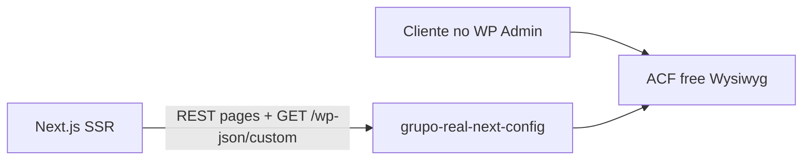

# CMS — Páginas institucionais

Autonomia de conteúdo para páginas do rodapé/institucional via WordPress (conteudo.realh) + Next.js SSR.

## Arquitetura



| Camada | Responsabilidade |
|--------|------------------|
| **Plugin** `wordpress/grupo-real-next-config/` | ACF JSON, template `institucional-documento`, menu location, Gutenberg off, REST |
| **Next** `src/lib/getPage.ts` | Busca `pages?slug=` + `acf` + Yoast |
| **Contrato** `src/constants/cms-config.ts` | Espelha `Config.php` do plugin |

## Template A — Documento (sidebar + Wysiwyg)

Sem Gutenberg. CTAs usam Repeater (ACF Pro).

Campos ACF:

| Campo | Tipo | Uso |
|-------|------|-----|
| `conteudo` | Wysiwyg | Texto principal (H2+, listas, tabelas, imagens) |
| `ctas` | Repeater | Botões (rotulo, url, target) — LGPD e outras |
| `exibir_formulario` | True/False | Atendimento ao titular |

H1 = primeiro heading do Wysiwyg ACF (`conteudo`). Se não houver heading, o Next usa o título da page WP.

Menu lateral: **Institucional Sidebar** via `GET /wp-json/custom` (plugin). Ícones nos itens pai: `icone` (select) + `icone_imagem` (opcional).

## Mapa de slugs (importante)

No WordPress, a landing **Grupo Real H** hoje usa o slug `institucional`. No Next ela é **`/quem-somos`** (TSX). Não misturar as duas.

| Onde | Slug WP | Rota Next | O que fazer |
|------|---------|-----------|-------------|
| Landing Grupo Real H | slug WP `quem-somos` | `/quem-somos` | Template **Landing institucional (Next)** |
| Pai agrupador | **nova** page `institucional` | `/institucional` redireciona para `/quem-somos` | Sem Wysiwyg. Só pai das políticas. |
| Políticas e documentos | filhas com template Documento | `/institucional/{slug}` | Qualquer slug. Sem lista no Next. |

Ordem no painel (não quebra o `npm run dev`):

1. Editar a page atual (Grupo Real H / slug `institucional`) → slug `quem-somos` → publicar
2. Criar **nova** page Institucional (slug `institucional`) como pai vazio
3. Criar filha `politica-de-privacidade` com pai Institucional

O catch-all Next ignora os slugs reservados `institucional` e `quem-somos`. **Nova página institucional:** template Documento + publicar + (opcional) item no menu Sidebar. Não precisa alterar código.

## Template B — Landing (Quem Somos)

Sem Gutenberg. Layout composto no Next; o cliente edita seções no ACF. Newsletter e formulários continuam React.

Template WP: **Landing institucional (Next)** (`institucional-landing`). Campo único **Seções** = Flexible Content (ACF Pro): o cliente escolhe o bloco (com skeleton), arrasta para reordenar e reutiliza o mesmo template em qualquer landing.

Não usar Documento — senão a page cairia em `/institucional/quem-somos`.

| Bloco (`acf_fc_layout`) | Uso |
|-------------------------|-----|
| `hero` | Banner com título, texto e fundo |
| `depoimento` | Citação + foto + CTA |
| `info_video` | Texto + YouTube |
| `info_imagem` | Texto + imagem (inverter / ler mais) |
| `atividades` | Intro + cards (missão, visão…) |
| `diretoria` | Cards de pessoas |
| `timeline` | Linha do tempo (repeater: ano, título, descrição, imagem opcional) |
| `texto` | Wysiwyg livre |
| `newsletter` | Componente React do site |

Se `secoes` estiver vazio no Quem Somos, o Next usa o fallback TSX (não quebra a página).

### WordPress (Quem Somos)

1. Atualizar o plugin para **1.4.0**
2. Page slug `quem-somos` → template **Landing institucional (Next)**
3. Clique na área tracejada ou em **Adicionar seção** — o popup mostra o esqueleto de cada bloco; arraste para mudar a ordem
4. **Linha do tempo:** bloco `timeline` → **Adicionar fato** (ano, título, descrição, imagem opcional). Ordem = cronologia no site
5. Yoast canonical: `https://gruporealbr.com.br/quem-somos`
6. Recarregar `/quem-somos`

Claudio Martins Real continua TSX até usar o mesmo template Landing.

## Páginas

| Slug | Rota Next | Fonte atual | CMS |
|------|-----------|-------------|-----|
| `quem-somos` | `/quem-somos` | TSX + ACF (template Landing) | **Sim** (fallback TSX se ACF vazio) |
| `politica-de-privacidade` | `/institucional/politica-de-privacidade` | `[slug]/page.tsx` | **Sim** |
| `politica-de-cookies` | `/institucional/politica-de-cookies` | `[slug]/page.tsx` | **Sim** |
| `lgpd` | `/institucional/lgpd` | `[slug]/page.tsx` | **Sim** |
| `politica-de-qualidade` | `/institucional/politica-de-qualidade` | `[slug]/page.tsx` | **Sim** (WP slug `politica-da-qualidade`) |
| `direito-dos-titulares` | `/institucional/direito-dos-titulares` | `[slug]/page.tsx` | **Sim** |
| `politica-de-privacidade-candidato` | `/institucional/politica-de-privacidade-candidato` | `[slug]/page.tsx` | **Sim** |
| `atendimento-ao-titular` | `[slug]/page.tsx` + form React | **Sim** (Wysiwyg + `exibir_formulario`) |
| Canal de Ética | link externo no menu | — |

Claudio Martins Real continua TSX (`/claudio-martins-real-curriculo`).

## Setup WordPress (checklist)

1. Copiar `wordpress/grupo-real-next-config` → `wp-content/plugins/` em conteudo.realh
2. Ativar plugin + ACF (free)
3. **Grupo Real / Next** no admin — conferir checklist (conflito de slug `institucional`)
4. Renomear a page Grupo Real H para slug `quem-somos` **antes** de criar o pai
5. Criar menu **Institucional Sidebar** (ver README do plugin)
6. Nova página mãe `Institucional` (slug `institucional`, só agrupadora) + filha `politica-de-privacidade`
7. Template **Documento institucional (Next)** só nas filhas (políticas)
8. Colar conteúdo no Wysiwyg; subir imagens institucionais na mídia
9. Yoast: title, description, canonical

## Setup Next

Variáveis em `.env.local`:

- `NEXT_PUBLIC_WP_URL_API` — REST v2
- `NEXT_PUBLIC_WP_URL_API_CUSTOM` — REST do plugin (`.../wp-json/custom/`), sidebar em `institutional-sidebar`
- `NEXT_PUBLIC_URL_HOST` — URL pública do front

Após publicar no WP, a rota `/institucional/politica-de-privacidade` renderiza SSR. Validar com **Ver código-fonte** (texto no HTML).

## Atendimento ao titular

O texto é CMS. O formulário **não** vai no Wysiwyg: é o Client Component `AtendimentoTitularForm` (POST em `api/v1/atendimento-titular/`).

### WordPress

1. Page slug `atendimento-ao-titular`, template **Documento institucional (Next)**
2. Wysiwyg `conteudo` — H1 + os dois parágrafos (sem colar o HTML do form):

```html
<h1>Atendimento ao Titular</h1>
<p>Este é o Formulário de Solicitação de Atendimento aos Titulares da REAL H, onde oferecemos a você a oportunidade de exercer um dos seus direitos previstos na Lei Geral de Proteção de Dados nº. 13.709/2018 (LGPD).</p>
<p>Para realizar as solicitações nos termos da LGPD, é necessário preencher o Formulário abaixo:</p>
```

3. Ligar **Exibir formulário de atendimento ao titular** (`exibir_formulario`)
4. Sem CTAs
5. Yoast canonical: `https://gruporealbr.com.br/institucional/atendimento-ao-titular`

Confira no REST: `pages?slug=atendimento-ao-titular&acf_format=standard` deve ter `acf.conteudo`. Com o flag desligado, o form **não** aparece.

### Testar

1. Recarregar `/institucional/atendimento-ao-titular` — texto do ACF. Form só com `exibir_formulario` ligado
2. Ver código-fonte: HTML do Wysiwyg no SSR; o form pode ser hidratado no cliente
3. Enviar vazio / CPF inválido — validação impede o POST
4. Submit ok → `Formulário enviado com sucesso!` e POST 200 em `atendimento-titular/`
5. Sidebar: item ativo; canonical `https://gruporealbr.com.br/institucional/atendimento-ao-titular` (não `conteudo.`)

## Nova página institucional (autonomia do cliente)

Não há whitelist de slugs no Next. O contrato é o **template**.

1. Páginas → Adicionar nova (pai: Institucional)
2. Template **Documento institucional (Next)**
3. Slug = URL pública (`/institucional/{slug}`)
4. Wysiwyg **Conteúdo** (+ CTAs ou **Exibir formulário**, se precisar)
5. Yoast: canonical `https://gruporealbr.com.br/institucional/{slug}`
6. Incluir no menu **Institucional Sidebar** (item do tipo Página)
7. Publicar — a rota existe no Next no próximo request (`dynamicParams`)
8. Sitemap: entra em `/sitemap/institucional.xml` (pages com template Documento; cache 1h)

## Alterar contrato

1. Editar `wordpress/.../src/Config.php` e `acf-json/*.json`
2. Espelhar em `src/constants/cms-config.ts`
3. Deploy plugin + Next
